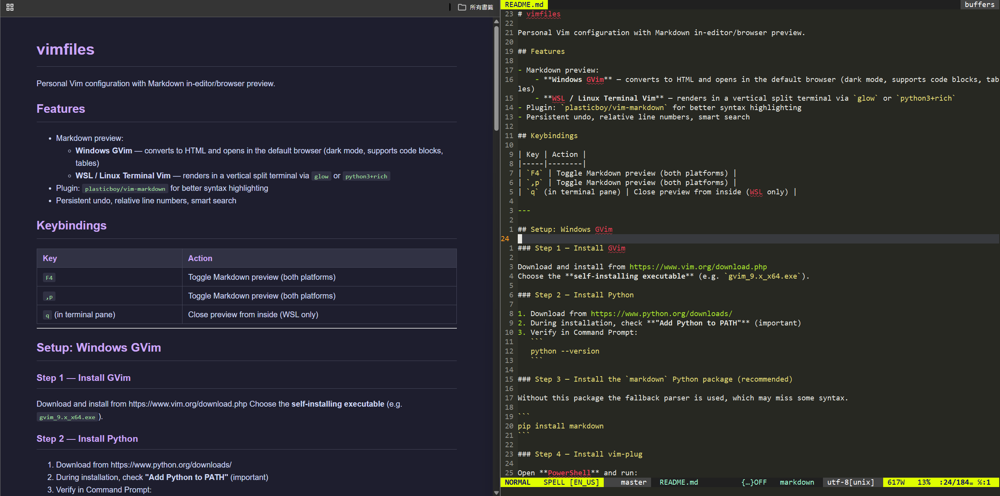

# vimfiles

Personal Vim configuration with Markdown in-editor/browser preview.

## Features

- Markdown preview:
    - **Windows GVim** — converts to HTML and opens in the default browser (dark mode, supports code blocks, tables, images)
    - **WSL** — converts to HTML (images embedded as base64) and opens in the default Windows browser
    - **Pure Linux Terminal Vim** — renders in a vertical split terminal via `glow` or `python3+rich`
- Plugin: `plasticboy/vim-markdown` for better syntax highlighting
- Persistent undo, relative line numbers, smart search

## Keybindings

| Key | Action |
|-----|--------|
| `F4` | Toggle Markdown preview (both platforms) |
| `,p` | Toggle Markdown preview (both platforms) |
| `q` (in terminal pane) | Close preview from inside (WSL only) |

---

## Setup: Windows GVim

### Step 1 — Install GVim

Download and install from https://www.vim.org/download.php
Choose the **self-installing executable** (e.g. `gvim_9.x_x64.exe`).

### Step 2 — Install Python

1. Download from https://www.python.org/downloads/
2. During installation, check **"Add Python to PATH"** (important)
3. Verify in Command Prompt:
   ```
   python --version
   ```

### Step 3 — Install the `markdown` Python package (recommended)

Without this package the fallback parser is used, which may miss some syntax.

```
pip install markdown
```

### Step 4 — Install vim-plug

Open **PowerShell** and run:

```powershell
iwr -useb https://raw.githubusercontent.com/junegunn/vim-plug/master/plug.vim |`
    ni "$env:USERPROFILE\vimfiles\autoload\plug.vim" -Force
```

### Step 5 — Set up vimrc

**Option A — Symlink (requires running as Administrator):**

Open Command Prompt as Administrator:
```
mklink %USERPROFILE%\_vimrc C:\path\to\vimfiles\vimrc
```

**Option B — Source from `_vimrc` (no admin needed):**

Create `%USERPROFILE%\_vimrc` with this single line (adjust path):
```vim
source C:/Users/YourName/path/to/vimfiles/vimrc
```

> Use forward slashes `/` in the path inside `_vimrc`.

### Step 6 — Create undo directory

```
mkdir %USERPROFILE%\.vim\undodir
```

### Step 7 — Install plugins

Open GVim and run:
```vim
:PlugInstall
```

Wait for `vim-markdown` to finish, then restart GVim.

### Step 8 — Verify

1. Open any `.md` file in GVim
2. Save it with `:w`
3. Press `F4` — the default browser should open with a dark-mode rendered preview



---

## Setup: WSL / Linux (Terminal Vim)

### Step 1 — Install Vim with terminal support

```bash
sudo apt install vim
```

Verify `:terminal` is available:
```bash
vim --version | grep +terminal
```

### Step 2 — Install glow

```bash
mkdir -p ~/.local/bin
curl -fsSL https://github.com/charmbracelet/glow/releases/download/v2.1.1/glow_2.1.1_Linux_x86_64.tar.gz \
  | tar -xz -C /tmp glow_2.1.1_Linux_x86_64/glow
mv /tmp/glow_2.1.1_Linux_x86_64/glow ~/.local/bin/glow
chmod +x ~/.local/bin/glow
```

Verify:
```bash
glow --version
```

> If `~/.local/bin` is not in your PATH, add `export PATH="$HOME/.local/bin:$PATH"` to `~/.bashrc`.

### Step 3 — Install vim-plug

```bash
curl -fLo ~/.vim/autoload/plug.vim --create-dirs \
    https://raw.githubusercontent.com/junegunn/vim-plug/master/plug.vim
```

### Step 4 — Symlink vimrc

```bash
ln -s /path/to/vimfiles/vimrc ~/.vimrc
```

### Step 5 — Create undo directory and install plugins

```bash
mkdir -p ~/.vim/undodir
vim +PlugInstall +qall
```

### Step 6 — Verify

1. Open any `.md` file: `vim file.md`
2. Save with `:w`
3. Press `F4` — the default Windows browser opens with a dark-mode rendered preview (images included)

---

## Refreshing the preview

The preview is a one-shot render. After editing and saving (`:w`):

- **Windows / WSL**: Press `F4` — a new browser tab opens with updated content

---

## Fallback behaviour

| Condition | Renderer used |
|-----------|--------------|
| Windows, `markdown` package installed | `markdown` (full support) |
| Windows, no `markdown` package | Built-in regex fallback (headings, bold, italic, code blocks) |
| WSL | Browser (via `python3` + `wslpath` + `cmd.exe`) |
| Pure Linux, `glow` installed | `glow` (terminal split) |
| Pure Linux, no `glow` | `python3 + rich` (terminal split) |

---

## File structure

```
vimfiles/
├── vimrc          # Main Vim config (symlinked to ~/.vimrc or sourced from ~/_vimrc)
├── setup.sh       # Automated setup script for WSL/Linux
├── setup.ps1      # Automated setup script for Windows (PowerShell)
└── README.md      # This file
```
